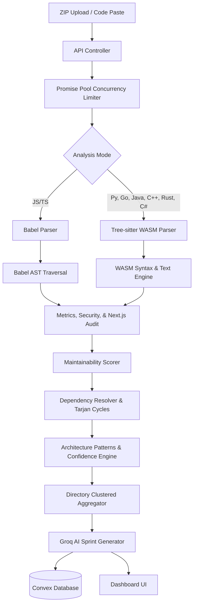
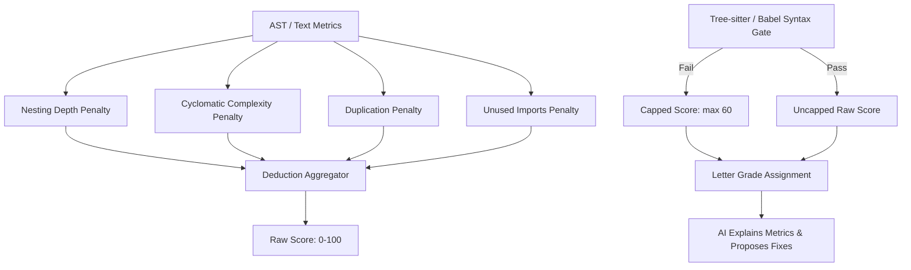
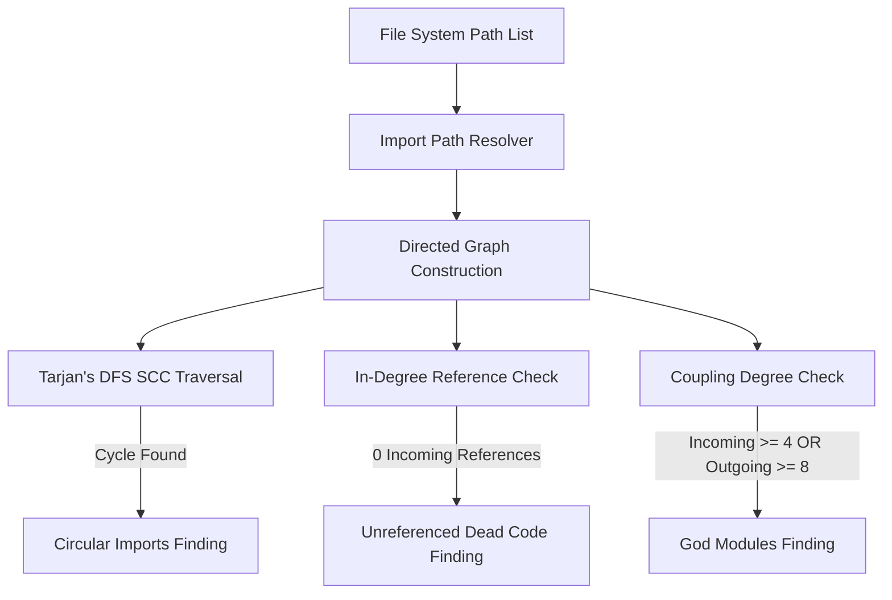

# Aurelin 🩺

> **An Explainable Static Analysis & Architecture Intelligence Platform.**
>
> Grounded in deterministic metrics and graph algorithms. Enhanced by AI coaching. Not another opinionated, hallucination-prone AI wrapper.
>
> Drop in a single file or an entire ZIP — Aurelin parses your codebase, maps its import architecture, scans for security/framework issues, calculates explainable health scores, and tracks improvements scan-to-scan.

---

## 🚀 Key Features

*   **Explainable Scoring & Deductions**: Metric-based maintainability scoring (0-100) with detailed average deductions per file, plus an interactive *What-If Playbook* simulating score boosts for specific refactoring actions.
*   **Architectural Pattern Recognition**: Deterministic heuristic matching detecting MVC, Repository, Clean/Hexagonal, Event-Driven queue, Monorepos, and Next.js App Router architectures—annotated with explicit **Confidence Levels (0-100%)** and matched evidence lists.
*   **Security Smell Detection**: Static checks scan for dynamic execution (`eval()`, `exec()`), React XSS attributes (`dangerouslySetInnerHTML`), exposed secrets/API credentials, and raw SQL injection vulnerabilities.
*   **Next.js Framework Audit**: Special analysis checks for React App Router convention matching and Client Component rules violations (such as importing server-side drivers or Prisma clients inside `"use client"` modules).
*   **Scan Evolution Deltas**: Instantly compares scans across a project to show files changed, lines modified, score fluctuations, and resolved circular cycles or dead code files since your last run.
*   **Tarjan's Circular Dependency Detector**: Linear-time cycle detection locating circular imports (`A ➔ B ➔ C ➔ A`) using directed graphs.
*   **WASM Syntax Gates**: Secure, sandboxed WebAssembly parsers (`web-tree-sitter`) checking syntax for Python, Go, Java, C++, Rust, C#, and C without spawning un-sandboxed shell processes.
*   **AST Deep Analysis**: JavaScript/TypeScript traversal checking nesting depth, function length, code duplication, and unused imports.
*   **Parent Directory Clustering**: Folder-based aggregation of issues, with AI-synthesized sprint plans and prioritized fixes.
*   **Shareable Reports**: Public reports with adjustable visibility controls.

---

## 📖 How Aurelin Works

When you upload a single source file or an entire project ZIP, Aurelin processes your code through six distinct analysis stages:

```
[Upload] ➔ [Decompress & Promise Pool] ➔ [Parse & Audit] ➔ [Graph & Cycles] ➔ [Scoring & Deltas] ➔ [AI Coach] ➔ [Dashboard]
```

### Step 1 — Read the Project
The uploaded ZIP archive is decompressed in memory using `adm-zip`. Aurelin filters out non-source file paths (like macOS resource forks `._*`, `.git`, `node_modules`, and lock files). Supported source files are placed in an entry queue. To keep the server responsive, files are processed concurrently using a bounded promise pool.

### Step 2 — Parse Every File
For each collected file, Aurelin chooses the appropriate parsing path based on the file extension:

| Language | Mode | Parser |
| :--- | :--- | :--- |
| **JavaScript / TypeScript** | 🔬 Deep | Babel AST Parser (`@babel/parser`) |
| **Python** | ⚡ Quick | Tree-sitter WASM (`tree-sitter-python.wasm`) |
| **Go** | ⚡ Quick | Tree-sitter WASM (`tree-sitter-go.wasm`) |
| **Java** | ⚡ Quick | Tree-sitter WASM (`tree-sitter-java.wasm`) |
| **C++** | ⚡ Quick | Tree-sitter WASM (`tree-sitter-cpp.wasm`) |
| **Rust** | ⚡ Quick | Tree-sitter WASM (`tree-sitter-rust.wasm`) |
| **C#** | ⚡ Quick | Tree-sitter WASM (`tree-sitter-c_sharp.wasm`) |

The parser converts the flat code text into a structured Syntax Tree representing the hierarchical grammar of the source file.

### Step 3 — Extract Metrics & Audit Rules
The syntax tree is walked to extract structural and maintainability metrics:
- **Logical Complexity**: Counting decision branches (conditionals, loops, switches).
- **Block Nesting Depth**: Tracking how deeply loops/conditionals are nested.
- **Function/Module Length**: Counting lines inside functions.
- **Imports Tracking**: Capturing imports to detect unused declarations and build the dependency graph.
- **Code Duplication**: Checking code blocks using a sliding window.
- **Security Smells**: Flagging unsafe dynamic executions, exposed keys, XSS paths, or SQL injection strings.
- **Framework Violations**: Identifying database imports inside frontend-rendered Client Components.

### Step 4 — Build Project Intelligence
After individual file metrics are compiled, Aurelin builds a project-level dependency graph where files represent nodes and imports represent directed edges:
- Resolves Next.js root aliases (`@/`) and relative import pathways.
- Runs Tarjan's SCC algorithm on the directed graph to identify circular import loops.
- Flag God files (excessive in/out degree coupling) and dead code modules (0 incoming references).
- Groups issues by parent directories into folder-based directory clusters.
- Runs a rules engine checking folder setups and dependencies to recognize architectural patterns (like MVC, Clean, or Event-Driven) with calculated confidence bounds.

### Step 5 — Calculate Scores & Deltas
The maintainability score is computed by applying transparent, deterministic deductions to a starting score of 100 based on the extracted metrics. If the syntax parser flags errors, the file fails the **Correctness Gate** and its maintainability score is capped at `60`. 
Aurelin queries the Convex database for the project's scan history to calculate metric deltas (Δ score, Δ lines, Δ files) and tracks resolved circular cycles or dead code files since your last scan.

### Step 6 — AI Explanation
Finally, the project metrics, structural findings, security/framework violations, directory clusters, and correctness gates are passed to Llama 3.3 via Groq. **The AI does not invent or hallucinate the metrics.** Instead, it acts as an architectural coach: it reviews the static metrics, explains the root causes of deductions, generates sprint plan tips for directory clusters, and prioritizes the top fixes.

---

## 🏗️ System Architecture

### 1. Analysis Pipeline Flow
The following diagram illustrates how files flow from client upload to backend parsing, static analysis, AI coaching, and database storage:



### 2. Scoring Pipeline
Scoring penalties are computed deterministically prior to the AI pipeline:



### 3. Dependency Analysis Flow
The dependency analyzer maps project file couplings and isolates structural circular loops:



---

## ⚙️ Detailed Analysis Engine

Aurelin operates in two analysis modes depending on the language:

### 1. 🔬 Deep Mode (JavaScript / TypeScript)
For JavaScript and TypeScript files, Aurelin performs deep static analysis:
*   **Babel AST Traversal**: Generates a full Abstract Syntax Tree.
*   **Nesting Metrics**: Recursively walks loop structures (`ForStatement`, `WhileStatement`, `DoWhileStatement`) and conditional statements (`IfStatement`, `SwitchStatement`) to measure nesting depth.
*   **Unused Import Identification**: Traverses `ImportSpecifier` bindings and checks if they are referenced anywhere in the module's scope, including JSX component declarations.

### 2. ⚡ Quick Mode (Python, Go, Java, C++, Rust, C#)
For other backend languages, Aurelin uses a hybrid WebAssembly parser:
*   **WASM Syntax Gates**: Dynamically loads compiled language grammars (`tree-sitter-python.wasm`, `tree-sitter-go.wasm`, etc.) via `web-tree-sitter` in a secure sandbox.
*   **Syntax Error Tracing**: Traverses the syntax tree for `ERROR` nodes and `isMissing()` tokens to capture exact syntax error messages, line numbers, and column offsets.
*   **Regex Metric Extraction**: Identifies function boundaries, parameters, nesting blocks, and line metrics using language-specific regular expressions when full ASTs are unavailable.

### 3. 🔒 Security Analysis Gate
Aurelin performs static security scans on all files:
*   **Unsafe Execution**: Flags functions like JavaScript `eval()` or Python `eval()` / `exec()` that process user strings dynamically.
*   **Credential Exposure**: Checks variable declarations against token signatures to locate hardcoded Slack API keys, private passwords, and JWT secret constants.
*   **SQL Injection**: Evaluates DB query parameters to detect raw string concatenations or unescaped templates within database operations (e.g. `db.query("SELECT ... WHERE id = " + id)`).

### 4. ⚡ Next.js Framework Audit
If a Next.js environment is detected, Aurelin runs specialized checks:
*   **Frontend/Backend Boundaries**: Inspects Client Components (marked by `"use client"`) and flags direct server-side driver imports like `@prisma/client`, `convex/server`, `pg`, or `mongoose`.
*   **App Router Matching**: Recognizes file-based conventions (`layout.tsx`, `page.tsx`, `route.ts`) to identify structure layouts.

---

## 🧮 Scoring Engine

### Deduction Formula
The score starts at **100** and is adjusted by subtracting the following penalties:

| Metric | Threshold | Penalty Calculation | Max Deduction |
| :--- | :--- | :--- | :--- |
| **Cyclomatic Complexity** | `> 1` | `(avg_complexity - 1) * 8` | `-25 pts` |
| **Function Length** | `> 20 lines` | `(avg_lines - 20) * 1.2` | `-20 pts` |
| **Nesting Depth** | `> 2 layers` | `(max_nesting - 2) * 15` | `-20 pts` |
| **Duplication** | `> 0%` | `duplication_percentage * 2` | `-20 pts` |
| **Unused Imports** | `> 0` | `unused_imports * 10` | `-15 pts` |

### Concrete Code Example

#### Input (Bad Python Code):
```python
def process_data(a, b, c, d, e, f, g):  # ❌ Too many parameters (7)
    # Nesting Depth 5 ❌
    if a:
        for item in b:
            if c:
                while d:
                    if e:
                        print("Item found:", item)  # ❌ Deep nesting
```

#### Aurelin Scorecard:
*   **Correctness Gate**: `Pass` (Valid Python syntax).
*   **Extracted Metrics**: Nesting Depth: `5`, Parameter Count: `7`.
*   **Deductions Applied**:
    *   Nesting Depth Penalty: `-20 pts` (Max nesting capped at threshold).
    *   Complexity Penalty: `-15 pts` (Complexity paths from nested statements).
*   **Final Maintainability Score**: **65 / 100** (Grade: **Fair**).
*   **AI Recommendation**: *"Flatten conditional nesting in `process_data`. Extract the inner loop logic into a helper function and consolidate the 7 parameters into a configuration object."*

---

## 🔬 Structural Analysis & Algorithms

### 1. Tarjan's Strongly Connected Components (SCC)
*   **What it is**: A graph algorithm that finds circular subgraphs in a single depth-first search (DFS) pass.
*   **Why it matters**: Circular dependencies (`A ➔ B ➔ A`) tightly couple modules, making them brittle, hard to test, and difficult to refactor. Aurelin runs Tarjan's algorithm to identify these cycles in linear time **$O(V + E)$**, mapping loops on your dashboard without blocking the API handler.

### 2. Promise Pool Concurrency Limiter
*   **What it is**: A custom promise pool that limits active file analysis operations.
*   **Why it matters**: Analyzing large project uploads synchronous-style blocks the single-threaded Node.js event loop. Using unrestricted `Promise.all` can crash Vercel serverless containers due to CPU spikes or out-of-memory issues. Aurelin uses a **concurrency limit of 6** to process files in parallel, keeping memory usage low and response times fast.

### 3. Heuristic Architecture Recognizer
*   **What it is**: An evidence-first design engine inspecting directory trees, filenames, and import patterns:
    *   **MVC**: Matches `/controllers/`, `/models/`, and `/views/`. (Confidence: 35-95%).
    *   **Repository**: Matches `*Repository.*` file names and dependencies like `prisma`, `pg`, `sequelize`. (Confidence: 60-95%).
    *   **Clean/Hexagonal**: Matches `/entities/`, `/usecases/`, `/adapters/`, or `/ports/`. (Confidence: 50-95%).
    *   **Event-Driven Broker**: Matches queue folders and dependencies like `bullmq`, `amqplib`, `kafkajs`. (Confidence: 60-95%).
    *   **Monorepo**: Identifies multiple nested manifests (`package.json`). (Confidence: 90%).

---

## 📂 Project Structure

```
aurelin/
├── app/                  # Next.js App Router (Pages, Dashboard, Scan Share Viewer)
├── components/           # UI Components (Gauge Meters, Mermaid Graphs, AI Panels)
├── convex/               # Convex Database (Schemas, Scans mutations, Delta Queries)
├── lib/
│   ├── ai/               # AI Provider Wrappers (Groq API, Sprint Generators)
│   ├── db/               # Database client interfaces
│   └── analyzer/         # Core static analysis engine
│       ├── aggregate.ts  # Rules engine, Tarjan SCC, Architecture recognition
│       ├── metrics.ts    # JS/TS AST parsing, Security checks, Next.js audits
│       ├── scorer.ts     # Deterministic deductions calculator
│       ├── textAnalyzer.ts # Regex-based fallbacks for quick languages
│       ├── syntaxCheck.ts# WebAssembly syntax validator loader
│       └── types.ts      # TypeScript interfaces
├── test-fixtures/        # Testing fixtures (Security flaws, React violations)
└── scripts/              # Helper copy-wasm and test-runner scripts
```

---

## 🛠️ Running Locally

### 1. Clone & Install Dependencies
Ensure you install dependencies, which will trigger the copy script for WASM grammar files:
```bash
npm install
```

To manually copy the WASM files to `/public/wasm/`:
```bash
node scripts/copy-wasm.js
```

### 2. Environment Configuration
Create a `.env.local` file in your root folder:
```env
NEXT_PUBLIC_CONVEX_URL=https://<your-project>.convex.cloud
NEXT_PUBLIC_CLERK_PUBLISHABLE_KEY=pk_test_...
CLERK_SECRET_KEY=sk_test_...
GROQ_API_KEY=gsk_...
BLOB_READ_WRITE_TOKEN=vercel_blob_rw_...
```

### 3. Database Sync & Run
```bash
# Push Convex schema
npx convex dev --once

# Run static analysis rules tests
npx tsx scripts/test-static-gates.ts

# Start development server
npm run dev
```
Open `http://localhost:3000` to view the platform.

---

## 📊 Self-Analysis Benchmark

To validate the analyzer's accuracy, Aurelin scanned its own `lib/` folder:
*   **97/100 — Excellent** overall maintainability score.
*   Correctly identified [metrics.ts](file:///Users/srinivasch/Documents/Projects/Aurelin/ai-project/lib/analyzer/metrics.ts) as the weakest file (**83/100**) due to a highly nested 17-path cyclomatic complexity routine.
*   Correctly identified [aggregate.ts](file:///Users/srinivasch/Documents/Projects/Aurelin/ai-project/lib/aggregate.ts) as a God file candidate due to high import-coupling.

---

## 🧠 Design Decisions

*   **Why static metrics first?** Grounding recommendations in concrete, AST-derived numbers builds developer trust and guarantees reproducible grades.
*   **Why use WebAssembly?** Running sandboxed WASM syntax checkers for Python, Go, and Rust allows checking syntax without spawning shell commands or installing compilers in the serverless backend.
*   **Why use Convex for history?** Real-time mutations allow users to see their project score improve scan-to-scan instantly without page reloads.
*   **Why skip GitHub Cloning/OAuth?** Bypassing GitHub APIs prevents placement discussions from shifting to basic OAuth token storage or server side rate-limits, keeping interview focus entirely on static analysis engines and graph algorithms.

---

## 🗺️ Roadmap

*   **Phase 1: AST Parser & Deductions Engine** (COMPLETE)
*   **Phase 2: Multi-Language ZIP Uploads & Resource Fork Filters** (COMPLETE)
*   **Phase 3: Convex History, Dashboard Trends, & Shareable Reports** (COMPLETE)
*   **Phase 4: WebAssembly Syntax Checking Gates & Promise Pooling** (COMPLETE)
*   **Phase 5: Heuristic Architecture Recognition, Security Rules, Next.js Audit, & Comparative Scan Diffs** (COMPLETE)
*   **Phase 6: VS Code Extension Inline Metrics Sidebar** (PLANNED)

---

## 📄 License
This project is licensed under the MIT License - see the LICENSE file for details.
